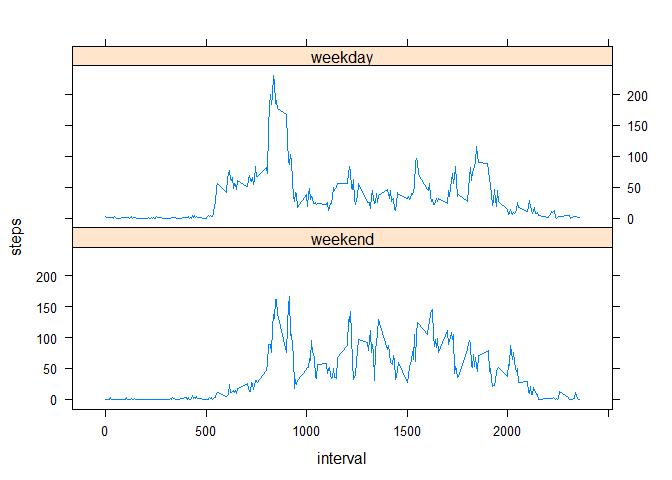

# Reproducible Research: Peer Assessment 1


## Loading and preprocessing the data

1. Load the data into data frame acts. The data between 8:30 and 9:00 on 2012-11-02 are listed below for example.

```r
acts <- read.csv(unz("activity.zip", "activity.csv"), header=T)
acts[ acts$date == "2012-11-02" & acts$interval >= 830 & acts$interval <= 900, ]
```

```
##      steps       date interval
## 9319   748 2012-11-02      830
## 9320   708 2012-11-02      835
## 9321   377 2012-11-02      840
## 9322   190 2012-11-02      845
## 9323   665 2012-11-02      850
## 9324    47 2012-11-02      855
## 9325    16 2012-11-02      900
```

2. No extra step is needed to process the data.

## What is mean total number of steps taken per day?

1. Calculate the total number of steps taken per day. Days/Intervals with empty values are ignored.

```r
daily <- aggregate(acts$steps, by=list(acts$date), FUN=sum)
names(daily)<-list("date", "steps")
daily
```

```
##          date steps
## 1  2012-10-01    NA
## 2  2012-10-02   126
## 3  2012-10-03 11352
## 4  2012-10-04 12116
## 5  2012-10-05 13294
## 6  2012-10-06 15420
## 7  2012-10-07 11015
## 8  2012-10-08    NA
## 9  2012-10-09 12811
## 10 2012-10-10  9900
## 11 2012-10-11 10304
## 12 2012-10-12 17382
## 13 2012-10-13 12426
## 14 2012-10-14 15098
## 15 2012-10-15 10139
## 16 2012-10-16 15084
## 17 2012-10-17 13452
## 18 2012-10-18 10056
## 19 2012-10-19 11829
## 20 2012-10-20 10395
## 21 2012-10-21  8821
## 22 2012-10-22 13460
## 23 2012-10-23  8918
## 24 2012-10-24  8355
## 25 2012-10-25  2492
## 26 2012-10-26  6778
## 27 2012-10-27 10119
## 28 2012-10-28 11458
## 29 2012-10-29  5018
## 30 2012-10-30  9819
## 31 2012-10-31 15414
## 32 2012-11-01    NA
## 33 2012-11-02 10600
## 34 2012-11-03 10571
## 35 2012-11-04    NA
## 36 2012-11-05 10439
## 37 2012-11-06  8334
## 38 2012-11-07 12883
## 39 2012-11-08  3219
## 40 2012-11-09    NA
## 41 2012-11-10    NA
## 42 2012-11-11 12608
## 43 2012-11-12 10765
## 44 2012-11-13  7336
## 45 2012-11-14    NA
## 46 2012-11-15    41
## 47 2012-11-16  5441
## 48 2012-11-17 14339
## 49 2012-11-18 15110
## 50 2012-11-19  8841
## 51 2012-11-20  4472
## 52 2012-11-21 12787
## 53 2012-11-22 20427
## 54 2012-11-23 21194
## 55 2012-11-24 14478
## 56 2012-11-25 11834
## 57 2012-11-26 11162
## 58 2012-11-27 13646
## 59 2012-11-28 10183
## 60 2012-11-29  7047
## 61 2012-11-30    NA
```

2. Make a histogram of the total number of steps taken each day

```r
hist(daily$steps, xlab="Steps per day", ylab="Number of days", main="Histograms of total Steps per day")
```


3. Calculate and report the mean and median of the total number of steps taken per day

```r
daily_mean <- mean(daily$steps, na.rm=T)
print(paste("Mean of the total number of steps taken per day =", daily_mean))
```

```
## [1] "Mean of the total number of steps taken per day = 10766.1886792453"
```

```r
daily_median <- median(daily$steps, na.rm=T)
print(paste("Median of the total number of steps taken per day =", daily_median))
```

```
## [1] "Median of the total number of steps taken per day = 10765"
```

## What is the average daily activity pattern?
1. Make a time series plot (i.e. type = "l") of the 5-minute interval (x-axis) and the average number of steps taken, averaged across all days (y-axis)

```r
avg_interval <- aggregate(acts$steps, by=list(acts$interval), FUN=mean, na.rm=T)
names(avg_interval) <- list("interval", "steps")
plot(avg_interval, type="l", main="Average daily activity pattern")
```


2. Which 5-minute interval, on average across all the days in the dataset, contains the maximum number of steps

```r
max_avg <- avg_interval[ which.max( avg_interval[,2]),]
print(paste("The interval containing maximum steps is" , max_avg$interval, ". And the maximum average steps are", max_avg$steps))
```

```
## [1] "The interval containing maximum steps is 835 . And the maximum average steps are 206.169811320755"
```

## Imputing missing values
There are a number of days/intervals where there are missing values (coded as NA). The presence of missing days may introduce bias into some calculations or summaries of the data.

1. Calculate and report the total number of missing values in the dataset (i.e. the total number of rows with NAs)

```r
num_na = sum(is.na(acts$steps))
print(paste("The total number of rows with NAs is", num_na))
```

```
## [1] "The total number of rows with NAs is 2304"
```

2. Use the 5-minute interval mean for the missing interval.


3. Create a new dataset that is equal to the original dataset but with the missing data filled in. The first 6 rows not are filled with data.

```r
acts_no_na <- merge(acts, avg_interval, by="interval")

acts_no_na$steps.x <- ifelse(is.na(acts_no_na$steps.x), round(acts_no_na$steps.y), acts_no_na$steps.x)
acts_no_na$steps.y<- NULL
names(acts_no_na) <- list("interval", "steps", "date")

## The following codes just rearrange columns and rows. It is just for getting the same format as the original data.

acts_no_na <- acts_no_na[c("steps", "date", "interval")]
acts_no_na <- acts_no_na[with(acts_no_na, order(date, interval)), ]
head(acts_no_na)
```

```
##     steps       date interval
## 1       2 2012-10-01        0
## 63      0 2012-10-01        5
## 128     0 2012-10-01       10
## 205     0 2012-10-01       15
## 264     0 2012-10-01       20
## 327     2 2012-10-01       25
```

4. Make a histogram of the total number of steps taken each day and Calculate and report the mean and median total number of steps taken per day. Do these values differ from the estimates from the first part of the assignment? What is the impact of imputing missing data on the estimates of the total daily number of steps?

```r
daily_no_na <- aggregate(acts_no_na$steps, by=list(acts_no_na$date), FUN=sum)
names(daily_no_na)<-list("date", "steps")
hist(daily$steps, xlab="Steps per day", ylab="Number of days", main="Histograms of total Steps per day (No NA)")
```


```r
daily_mean_no_na <- mean(daily_no_na$steps)
print(paste("Mean of the total number of steps taken per day (no NA) =", daily_mean_no_na))
```

```
## [1] "Mean of the total number of steps taken per day (no NA) = 10765.6393442623"
```

```r
print(paste("It is", ifelse(daily_mean== daily_mean_no_na, "the same as", "different to"), "the value with na."))
```

```
## [1] "It is different to the value with na."
```

```r
daily_median_no_na <- median(daily_no_na$steps)
print(paste("Median of the total number of steps taken per day (no NA) =", daily_median_no_na))
```

```
## [1] "Median of the total number of steps taken per day (no NA) = 10762"
```

```r
print(paste("It is", ifelse(daily_median== daily_median_no_na, "the same as", "different to"), "the value with na."))
```

```
## [1] "It is different to the value with na."
```

## Are there differences in activity patterns between weekdays and weekends?

1. Create a new factor variable in the dataset with two levels - "weekday" and "weekend" indicating whether a given date is a weekday or weekend day.

```r
acts_no_na$weekday <- factor((weekdays( as.Date(acts_no_na$date,"%Y-%m-%d")) %in% 
                                 c('Monday', 'Tuesday', 'Wednesday', 'Thursday', 'Friday')), 
                              levels=c(FALSE, TRUE), labels=c('weekend', 'weekday'))
head(acts_no_na)
```

```
##     steps       date interval weekday
## 1       2 2012-10-01        0 weekday
## 63      0 2012-10-01        5 weekday
## 128     0 2012-10-01       10 weekday
## 205     0 2012-10-01       15 weekday
## 264     0 2012-10-01       20 weekday
## 327     2 2012-10-01       25 weekday
```

2. Make a panel plot containing a time series plot (i.e. type = "l") of the 5-minute interval (x-axis) and the average number of steps taken, averaged across all weekday days or weekend days (y-axis). 


```r
avg_interval_no_na <- aggregate(acts_no_na$steps, by=list(acts_no_na$interval, acts_no_na$weekday), FUN=mean)
head(avg_interval_no_na)
```

```
##   Group.1 Group.2    x
## 1       0 weekend 0.25
## 2       5 weekend 0.00
## 3      10 weekend 0.00
## 4      15 weekend 0.00
## 5      20 weekend 0.00
## 6      25 weekend 3.50
```

```r
names(avg_interval_no_na) <- list("interval", "weekday", "steps")

par(mfrow=c(2,1))
par(mar=c(2,2,1,2))
plot(avg_interval_no_na[avg_interval_no_na$weekday=="weekday", c(1,3)], type="l", axes=F, frame.plot=T, ann=F, 
     col="blue")
axis(side=2, labels=F, tick=T)
axis(side=3, labels=F, tick=T)
axis(side=4, labels=T, tick=T)

title(main="weekday", cex.main=0.7)

plot(avg_interval_no_na[avg_interval_no_na$weekday=="weekend", c(1,3)], type="l", axes=F, frame.plot=T, ann=F,
     col="blue")
axis(side=1, labels=T, tick=T)
axis(side=2, labels=T, tick=T)
axis(side=4, labels=F, tick=T)

title(main="weekend", cex.main=0.7)
```



